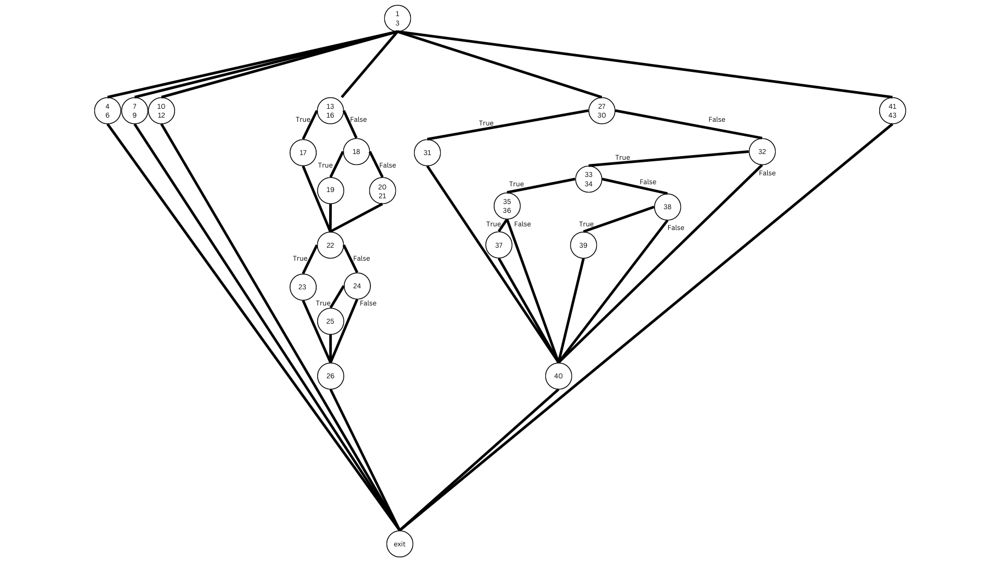

# C# Testing with NUnit

Intro, motivatie
----------------
Motivatia pentru a alege acest proiect este datorata experientei de lucrul a amandurora. Amandoi lucram cu obiecte geometrice zilnic, intr-un mediu dominat de testarea continua a codului dezvoltat. Ca limbaj am ales C#, intrucat ne-am mai intalnit in trecut cu limbajul, si, de asemenea punctul nostru forte este dezvoltarea de cod in C si C++, acestea doua reprezentand inspiratia care sta la baza crearii limbajului C#.

Utilitare folosite
------------------
NUnit

Stryker

Videoclip Youtube
-----------------
https://youtu.be/qnpsS8sYl0Y

Testare functionala - partitionare
----------------------------------

1.	 Vom testa daca un punct A(x, y, z) se afla in interiorul bounding box-ului unui cub (IsPointInsideCubeBB).
	 Programul va primi n=8 puncte care definesc un cub sau n=1 punct care defineste centrul si o lungime a laturii, un punct p, pentru care se verifica
	 daca este in bounding box sau nu, si o toleranta.

	 Intrari:
		a. un punct p
		b. o valoare a tolerantei, tol
		c. o lista de puncte vertices, care formeaza un cub
			sau
		d. optional, lungimea laturii length
		
	Lungimea listei, n, trebuie sa fie 1 sau 8. Astfel, putem distinge mai multe clase de echivalenta:
	N_1 = {n | n < 1}
	N_2 = 1
	N_3 = 2..7
	N_4 = 8
	N_5 = {n | n > 8}

	Toleranta tol nu determina alte clase de echivalenta

	Lungimea laturii este un parametru optional.

	L_1 = null
	L_2 = not null

	Domeniul de iesire consta in 2 raspunsturi posibile: True daca punctul se afla in BB si False daca nu se afla. 
	P_1 = {True | P(x,y,z) aparting BBox cub}
	P_2 = {False | P(x, y, z) nu aparting BBox cub}

	Astfel, putem distinge clasele de echivalenta globale:

	C_1 = {(P, tol, vertices, len) | |vertices| = n, n in N_1}
	C_211 = {(P, tol, vertices, len) | |vertices| = n, n in N_2, len in L_1, P in P_1}
	C_212 = {(P, tol, vertices, len) | |vertices| = n, n in N_2, len in L_1, P in P_2}
	C_221 = {(P, tol, vertices, len) | |vertices| = n, n in N_2, len in L_2, P in P_1}
	C_222 = {(P, tol, vertices, len) | |vertices| = n, n in N_2, len in L_2, P in P_2}
	C_3 = {(P, tol, vertices, len) | |vertices| = n, n in N_3|}
	C_41 = {(P, tol, vertices, len) | |vertices| = n, n in N_4, P in P_1}
	C_42 = {(P, tol, vertices, len) | |vertices| = n, n in N_4, P in P_2}
	C_5 = {(P, tol, vertices, len) | |vertices| = n, n in N_5}

	Pentru datele de test, putem folosi, spre exemplu:

	c_1:   (_,_,<>,_)
	c_211: (_, _, <(1, 1, 1)>, null)
	c_221: ((1, 1, 1), 0.1, <(1, 1, 1)>, 2)
	c_222: ((5, 7, 6.5), 0.1, <(1, 1, 1)>, 2)
	c3:    (_, _, <(1, 5, 7), (2, 2, 3), (3, 4, 2)>, _)
	c41:   ((1, 2, 2), 0.2, <(-1, -1, 0), (1, -1, 0), (1, 1, 0), (-1, 1, 0), (-1, -1, 3), (1, -1, 3), (1, 1, 3), (-1, 1, 3)>,_)
	c42:   ((10, 15, 11), 0.2, <(-1, -1, 0), (1, -1, 0), (1, 1, 0), (-1, 1, 0), (-1, -1, 3), (1, -1, 3), (1, 1, 3), (-1, 1, 3)>,_)
	c5:    (__, _, <(-1, -1, 0), (1, -1, 0), (1, 1, 0), (-1, 1, 0), (-1, -1, 3), (1, -1, 3), (1, 1, 3), (-1, 1, 3), (2, 2, 2)>,_)

Analiza valorilor de frontiera
------------------------------

	Avand clasele de echivalenta identificate, putem distinge valorile de frontiera:
	- N_1 = n(|vertices|) = 1
	- N_2 = n(|vertices|) = 8 
	- N_3 = n(|vertices|) = 0
	- N_4 = n(|vertices|) = 9
	- N_5 = n(|vertices|) = 5

	Pentru restul argumentelor putem lua valori arbitrare.

	Deci, spre exemplu, putem genera urmatoarele teste:

	C_1: ((1, 1, 1), 0.1, <(1, 1, 1)>, 2)
	C_2: ((1, 2, 2), 0.2, <(-1, -1, 0), (1, -1, 0), (1, 1, 0), (-1, 1, 0), (-1, -1, 3), (1, -1, 3), (1, 1, 3), (-1, 1, 3)>, 2)	 
	C_3: (_, _, <>, _)
	C_4: (((_, _, <(-1, -1, 0), (1, -1, 0), (1, 1, 0), (-1, 1, 0), (-1, -1, 3), (1, -1, 3), (1, 1, 3), (-1, 1, 3), (5, 5, 5)>, _)
	C_5: ((_, _, <(-1, -1, 0), (1, -1, 0), (1, 1, 0), (-1, 1, 0), (-1, -1, 3)>,_)

2. Vom testa o functie care calculeaza diferite tipuri de distante dintre doua puncte. (ComputeDistance)

Testare functionala - partitionare
----------------------------------	

	Intrari:
		a. Punctul de plecare (A), reprezentat prin coordonate 3D
        b. Punctul de sosire (B), reprezentat prin coordonate 3D
        c. Tipul distantei (type), care specifica distanta calculata (Euclidean, Manhattan, Chebyshev)

	In functie de parametrul type, putem distinge doua clase de echivalenta:
        a. T_1 = {x | x in {euclidean, manhattan, chebyshev}}
        b. T_2 = {x | x not in {euclidean, manhattan, chebyshev}}

	Coordonatele punctelor nu determina alte clase de echivalenta.

	Domeniul de iesire are mai multe raspunsuri posibile:

	C_1 = {dE(a, b) | type = euclidean}
    C_2 = {dM(a, b) | type = manhattan}
    C_3 = {dC(a, b) | type = chebyshev}
    C_4 = {0.0 | type not in {euclidean, manhattan, chebyshev}}

	Deci, clasele de echivalenta globale sunt:
	G_1 = {(A, B, type) | type in T_1}
	G_2 = {(_, _, type) | type in T_2}

	Pentru datele de test putem folosi:

	g1: ((1, 1, 1), (0, 0, 0), euclidean)
    g2: ((1, 1, 1), (0, 0, 0), manhattan)
    g3: ((1, 1, 1), (0, 0, 0), chebyshev)
	g4: ((1, 1, 1), (0, 0, 0), 2)

Analiza valorilor de frontiera
------------------------------

	Pentru valorile de frontiera, putem introduce clasele:

	P_1 = {a, b | a = b}
	P_2 = {a, b | ax < 10^-5, by < 10^-6}

	Restul argumentelor pot lua orice valoare.

	g1: ((2, 2, 2), (2, 2, 2), euclidean)
	g2: ((2, 2, 2), (2, 2, 2), manhattan)
	g3: ((2, 2, 2), (2, 2, 2), chebyshev)
	g4: ((0, 0.001, 0), (0.0001, 0, 0), euclidean)
	g5: ((0, 0.0001, 0), (0.00001, 0, 0), manhattan)
	g6: ((0, 0.00001, 0), (0.000001, 0, 0), chebyshev)

Acoperirea la nivel de instructiune, decizie, conditie
------------------------------------------------------
Am facut CFG-ul asociat unei functii care determina tipul figurii geometrice construite pe baza punctelor existente. Numerotarea liniilor de cod poate fi vazuta in fisierul Compute\FigureDecision.cs

Mutanti
-------
Raportul initial: [raport](/StrykerOutput/2024-05-12.19-12-36/reports/mutation-report.html)
Raportul final: [raport](/StrykerOutput/2024-05-12.19-04-25/reports/mutation-report.html)
Raport AI: [report](/StrykerOutput/2024-05-12.20-03-34/reports/mutation-report.html)

Pentru detalii, urmariti videoclipul.

Raport AI
---------
Am folosit modelul de inteligenta artificiala Microsoft Copilot. Query-urile date si raspunsurile primite pot fi vazute in folderul intitulat Copilot, asociat proiectului.

Dupa cum se poate observa, testele generate de AI au o eficienta sub medie. Scorul Stryker este de 9.7% acoperire, cu acoperire intre 20-25% pentru clasele Cube si Point.
Testele ruleaza conform asteptarilor, iar probabil ca, generand mai multe teste diferite (nu doar pentru partitionare si boundary value analysis), scorul ar fi mai apropiat de scorul
testelor scrise manual.